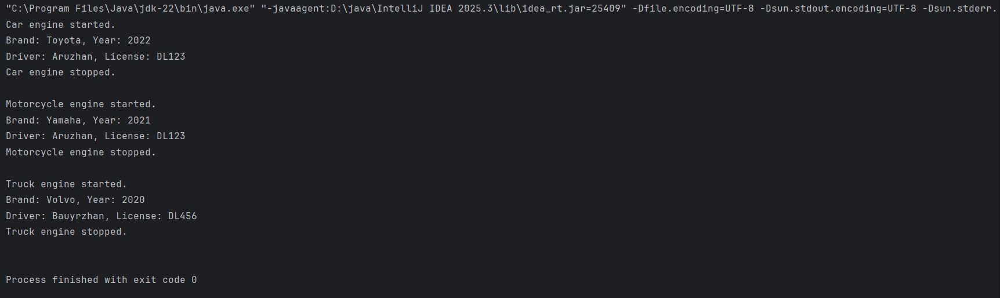
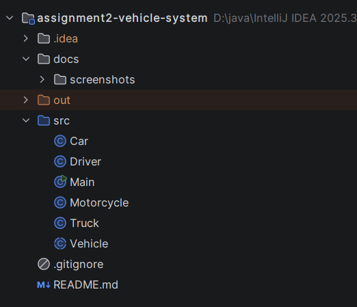

# Vehicle Management System

## Project Overview
This project is a Vehicle Management System implemented in Java to demonstrate
Object-Oriented Programming concepts such as inheritance, abstraction,
composition, aggregation, and method overriding.

The system models different types of vehicles using an abstract superclass
and multiple subclasses. Each vehicle can be associated with a driver, and
polymorphism is demonstrated using an array of Vehicle objects.

---

## Class Hierarchy and Design

### Vehicle (Abstract Class)
The `Vehicle` class is an abstract superclass that defines common properties
such as brand and year. It declares abstract methods for starting and stopping
the engine and provides a concrete method to display vehicle information.

### Car, Motorcycle, and Truck
These classes extend the `Vehicle` class and override the `startEngine()` and
`stopEngine()` methods to provide specific behavior. Each subclass includes
additional fields relevant to its type, such as doors, sidecar availability,
or load capacity.

### Driver
The `Driver` class represents a vehicle driver and contains basic information
such as name and license number. Each vehicle has a driver object (composition),
and one driver may be associated with multiple vehicles (aggregation).

---

## How to Compile and Run

### Using Terminal
```bash
javac *.java
java Main
```
---

### Using IntelliJ IDEA

1. Open the project in IntelliJ IDEA.


2. Open Main.java.


3. Click the green Run button next to the main method.

---

### Screenshots

#### Program Output


#### Project Structure



---

## Reflection

This assignment helped me understand how inheritance and abstraction simplify program design by allowing common 
behavior to be defined in a superclass. Method overriding made it possible to customize behavior for each vehicle type.
One challenge was correctly using protected access modifiers and constructor chaining with the super keyword. Overall, 
this project improved my understanding of object-oriented design and polymorphism in Java.